# 1. Introduction

## 1.1 Purpose

This Software Requirements Specification (SRS) document provides a comprehensive description of the Pollen8 web platform. It is intended for:
- Development team members implementing the system
- UI/UX designers creating the user interface
- Project managers overseeing development
- Quality assurance testers validating functionality
- Stakeholders evaluating project scope and features

The document outlines functional and non-functional requirements, user interface specifications, and technical constraints to ensure all parties have a clear understanding of the project deliverables.

## 1.2 Scope

Pollen8 is a professional networking web platform built using React.js, Node.js, Tailwind CSS, and D3.js. The platform's core functionalities include:

- User onboarding and verification via phone number
- Industry and interest-based profile creation
- Location-aware user profiles
- Network visualization and management
- Invite system with trackable links and analytics
- Network value calculation and display

Key benefits:
- Minimalist, modern black and white interface design
- Smooth animations and responsive interactions
- Data-driven network growth tracking
- Industry-specific networking capabilities

The platform aims to:
1. Facilitate meaningful professional connections
2. Provide quantifiable network value metrics
3. Enable targeted networking within specific industries
4. Offer detailed analytics on network growth and engagement

# 2. Product Description

## 2.1 Product Perspective

Pollen8 operates as a standalone web application within the professional networking ecosystem. While it interacts with external systems for user verification and location services, it maintains its own unique approach to network building and visualization. The platform:

- Utilizes modern web technologies (React.js, Node.js, Tailwind CSS, D3.js) for a responsive single-page application
- Interfaces with telecommunications providers for phone number verification
- Integrates with geolocation services to provide location-aware networking
- Operates independently of existing social networks while allowing for potential future integrations

## 2.2 Product Functions

The primary functions of Pollen8 include:

1. User Authentication and Verification
   - Phone number-based registration
   - Real-time verification system

2. Profile Management
   - Industry selection (minimum 3)
   - Interest tagging (minimum 3)
   - Location-based profile enhancement

3. Network Visualization and Analytics
   - Interactive D3.js-powered network graphs
   - Network value calculation (3.14 per connection)
   - Industry-specific network grouping

4. Invite System
   - Unique link generation
   - Click tracking and analytics
   - 30-day activity visualization

5. Connection Management
   - User profile grid view
   - Network feed with industry filters
   - Network growth tracking

## 2.3 User Characteristics

Target users of Pollen8 include:

1. Primary Persona: Professional Networker
   - Age: 25-45
   - Tech-savvy professionals
   - Seeks data-driven networking
   - Values visual representation of connections

2. Secondary Persona: Industry Connector
   - Focuses on specific industry verticals
   - Needs tools to manage multiple network groups
   - Appreciates analytical insights

3. Tertiary Persona: Growth-Focused Entrepreneur
   - Actively growing professional network
   - Requires tracking and measurement of network value
   - Utilizes invite system for strategic connections

All users are expected to:
- Have basic digital literacy
- Own a smartphone for verification
- Be comfortable with minimalist interfaces
- Value data-driven networking approaches

## 2.4 Constraints

1. Technical Constraints
   - Must maintain black and white aesthetic
   - Limited to web platform (no native mobile apps)
   - Phone number required for registration
   - Proxima Nova font family requirement

2. User Interface Constraints
   - Specific font sizes and weights
   - Strict color palette adherence
   - Predefined button styling and animations

3. Performance Constraints
   - Must support real-time graph rendering
   - Smooth animations for all interactions
   - Responsive design across devices

4. Regulatory Constraints
   - Phone number verification compliance
   - User data privacy regulations
   - Location data usage restrictions

## 2.5 Assumptions and Dependencies

Assumptions:
1. Users have consistent internet access
2. Modern web browsers support required features
3. Users are willing to verify via phone number
4. Network value can be quantified numerically

Dependencies:
1. External Services
   - Telecommunications provider for verification
   - Geolocation services for city detection
   - Cloud hosting platform

2. Technical Dependencies
   - React.js ecosystem
   - D3.js library compatibility
   - Node.js backend services
   - Tailwind CSS framework

3. User Engagement
   - Minimum of 3 industry/interest selections
   - Active participation in network building
   - Regular platform engagement for data accuracy

# 3. Process Flowchart


# 4. Functional Requirements

## 4.1 User Authentication and Verification

### ID: F-001
### Description
Phone number-based user authentication system that verifies user identity through SMS.
### Priority
High
### Functional Requirements

| ID | Requirement | Description |
|----|-------------|-------------|
| F-001.1 | Phone Number Entry | System shall provide an input field for users to enter their phone number with automatic formatting |
| F-001.2 | Number Validation | System shall validate phone number format before allowing verification |
| F-001.3 | SMS Verification | System shall send a verification code via SMS to the provided phone number |
| F-001.4 | Verification UI | System shall display a 4-second pulsing animation during verification process |
| F-001.5 | Status Updates | System shall update button text from "VERIFY" to "VERIFYING" to "VERIFIED" |
| F-001.6 | Session Management | System shall create and maintain a secure user session after successful verification |

## 4.2 Profile Creation and Management

### ID: F-002
### Description
Comprehensive profile setup and management system allowing users to define their professional identity.
### Priority
High
### Functional Requirements

| ID | Requirement | Description |
|----|-------------|-------------|
| F-002.1 | Industry Selection | System shall provide a dropdown with multiple industry options, requiring minimum 3 selections |
| F-002.2 | Interest Selection | System shall provide a dropdown for interests, requiring minimum 3 selections |
| F-002.3 | Location Detection | System shall auto-populate city based on user-entered ZIP code |
| F-002.4 | Profile Visualization | System shall display user profile with pulsing avatar and metadata grid |
| F-002.5 | Profile Editing | System shall allow users to modify their industry, interest, and location selections |
| F-002.6 | Data Validation | System shall enforce minimum selection requirements before profile completion |

## 4.3 Network Visualization and Analytics

### ID: F-003
### Description
Interactive visualization and analytical tools for understanding and managing professional networks.
### Priority
Medium
### Functional Requirements

| ID | Requirement | Description |
|----|-------------|-------------|
| F-003.1 | Network Graph | System shall generate interactive D3.js visualizations of user connections |
| F-003.2 | Value Calculation | System shall calculate network value at 3.14 per connection |
| F-003.3 | Growth Tracking | System shall display a line graph showing network growth over the past year |
| F-003.4 | Industry Grouping | System shall organize and display connections by industry |
| F-003.5 | Connection Grid | System shall provide a responsive grid view of all connections |
| F-003.6 | Metrics Dashboard | System shall display key network metrics including total connections and value |

## 4.4 Invite System

### ID: F-004
### Description
Comprehensive invite management system for tracking and analyzing network growth efforts.
### Priority
Medium
### Functional Requirements

| ID | Requirement | Description |
|----|-------------|-------------|
| F-004.1 | Link Generation | System shall generate unique, trackable invite links |
| F-004.2 | Link Management | System shall allow users to name and organize invite links |
| F-004.3 | Click Tracking | System shall track and display click counts for each invite link |
| F-004.4 | Activity Visualization | System shall display 30-day activity graphs for each invite link |
| F-004.5 | Link Copying | System shall provide one-click copying of invite URLs |
| F-004.6 | Link Analytics | System shall provide detailed analytics for invite link performance |

## 4.5 User Interface and Experience

### ID: F-005
### Description
Consistent and responsive user interface adhering to specific design guidelines.
### Priority
High
### Functional Requirements

| ID | Requirement | Description |
|----|-------------|-------------|
| F-005.1 | Responsive Design | System shall provide a fully responsive layout using Tailwind CSS |
| F-005.2 | Animation System | System shall implement smooth transitions and animations for all interactions |
| F-005.3 | Typography | System shall use Proxima Nova font family with specified sizes and weights |
| F-005.4 | Color Scheme | System shall maintain black and white aesthetic throughout the platform |
| F-005.5 | Button Styling | System shall implement consistent button styling with 50% left-side border radius |
| F-005.6 | Form Styling | System shall maintain consistent form field styling with 3px white borders |

# 5. Non-Functional Requirements

## 5.1 Performance

| ID | Requirement | Description | Target Metric |
|----|-------------|-------------|---------------|
| P-001 | Page Load Time | Initial page load time for any route | ≤ 2 seconds |
| P-002 | D3.js Rendering | Network graph rendering and animation performance | ≤ 1 second for up to 1000 nodes |
| P-003 | API Response Time | Server response time for API requests | ≤ 500 milliseconds |
| P-004 | Animation Smoothness | Frame rate for UI animations | 60 FPS |
| P-005 | Memory Usage | Client-side memory consumption | ≤ 256MB RAM |
| P-006 | Concurrent Users | Number of simultaneous users supported | 10,000 users |

## 5.2 Safety

| ID | Requirement | Description |
|----|-------------|-------------|
| S-001 | Data Backup | Automated daily backups of user data with 30-day retention |
| S-002 | Failover System | Redundant system deployment with automatic failover within 30 seconds |
| S-003 | Data Recovery | Recovery Point Objective (RPO) of 1 hour and Recovery Time Objective (RTO) of 4 hours |
| S-004 | Error Handling | Graceful degradation of features with user-friendly error messages |
| S-005 | Rate Limiting | Implementation of rate limiting to prevent system overload |
| S-006 | Monitoring | Real-time monitoring and alerting for system health and performance metrics |

## 5.3 Security

| ID | Requirement | Description |
|----|-------------|-------------|
| SE-001 | Authentication | Multi-factor authentication using phone number verification |
| SE-002 | Session Management | Secure session handling with JWT tokens and 24-hour expiration |
| SE-003 | Data Encryption | TLS 1.3 for data in transit and AES-256 for data at rest |
| SE-004 | API Security | Implementation of OAuth 2.0 for API authentication |
| SE-005 | Privacy Controls | User control over profile visibility and data sharing |
| SE-006 | Audit Logging | Comprehensive logging of all security-relevant events |

## 5.4 Quality

### 5.4.1 Availability
- System uptime of 99.9% (excluding scheduled maintenance)
- Maximum scheduled downtime of 4 hours per month
- Automated health checks every 5 minutes

### 5.4.2 Maintainability
- Modular React.js component architecture
- Comprehensive code documentation using JSDoc
- Automated testing coverage of minimum 80%
- CI/CD pipeline for automated deployment

### 5.4.3 Usability
- Adherence to WCAG 2.1 Level AA accessibility standards
- Consistent black and white UI theme across all pages
- Maximum of 3 clicks to reach any feature
- Responsive design supporting screen sizes from 320px to 4K

### 5.4.4 Scalability
- Horizontal scaling capability to handle 100% traffic increase
- Database sharding for improved query performance
- CDN integration for static asset delivery
- Microservices architecture for independent scaling

### 5.4.5 Reliability
- Mean Time Between Failures (MTBF) of 720 hours
- Mean Time To Repair (MTTR) of 2 hours
- Automated rollback capability for failed deployments
- Circuit breakers for external service dependencies

## 5.5 Compliance

| ID | Requirement | Description |
|----|-------------|-------------|
| C-001 | Data Protection | Compliance with GDPR and CCPA regulations |
| C-002 | Accessibility | WCAG 2.1 Level AA compliance for all user interfaces |
| C-003 | Phone Verification | Compliance with telecommunications regulations for SMS verification |
| C-004 | Data Retention | Implementation of data retention and deletion policies |
| C-005 | Terms of Service | Clear and legally compliant terms of service and privacy policy |
| C-006 | Industry Standards | Adherence to OAuth 2.0 and OpenID Connect standards |

# 6. Data Requirements

## 6.1 Data Models


## 6.2 Data Storage

### 6.2.1 Database Architecture
- Primary database: MongoDB for flexible schema and scalability
- Redis cache layer for high-performance data retrieval
- Time-series database (InfluxDB) for analytics data

### 6.2.2 Data Retention
- User profile data: Retained indefinitely while account is active
- Connection data: Retained indefinitely
- Invite analytics: Rolling 12-month retention
- Activity logs: 90-day retention

### 6.2.3 Redundancy and Backup
- Database replication with 3 nodes minimum
- Daily automated backups with 30-day retention
- Cross-region backup storage
- Point-in-time recovery capability up to 7 days

### 6.2.4 Scaling Strategy
- Horizontal sharding based on user ID
- Read replicas for analytics queries
- Automated scaling based on load metrics
- Data archiving for inactive users after 12 months

## 6.3 Data Processing

### 6.3.1 Data Flow

```mermaid
flowchart TD
    A[Client] -->|HTTPS| B[Load Balancer]
    B --> C[API Gateway]
    C --> D{Authentication Service}
    D -->|Token Validation| E[Application Servers]
    E -->|Read/Write| F[(Primary Database)]
    E -->|Cache| G[(Redis)]
    E -->|Analytics| H[(Time Series DB)]
    
    I[Backup Service] -->|Daily Backup| F
    I -->|Store| J[(Backup Storage)]
    
    K[Analytics Service] -->|Process| H
    K -->|Aggregate| L[(Analytics DB)]
```



### 6.3.2 Data Security
- Encryption at rest using AES-256
- TLS 1.3 for data in transit
- Field-level encryption for sensitive data
- Data masking for non-production environments

### 6.3.3 Data Processing Requirements

| Process Type | Requirement | Implementation |
|--------------|-------------|-----------------|
| User Verification | Real-time phone verification | SMS gateway integration with rate limiting |
| Network Value Calculation | Asynchronous processing | Background job queue using Redis |
| Analytics Aggregation | Daily batch processing | Scheduled Apache Spark jobs |
| Search Indexing | Near real-time updates | Elasticsearch with 1-minute refresh interval |

### 6.3.4 Data Validation

| Data Type | Validation Rules |
|-----------|------------------|
| Phone Number | E.164 format, unique constraint |
| ZIP Code | 5-digit US format, city lookup |
| Industries | Minimum 3 selections, predefined list |
| Interests | Minimum 3 selections, predefined list |
| Invite URLs | Unique, URL-safe encoding |

### 6.3.5 Data Integration
- RESTful API with JSON payload format
- GraphQL endpoint for complex data queries
- Webhook system for real-time data updates
- Batch import/export capabilities for data migration

### 6.3.6 Compliance and Privacy
- GDPR-compliant data processing
- Data anonymization for analytics
- User consent tracking for data usage
- Automated data purge for account deletions

# 7. External Interfaces

## 7.1 User Interfaces

### 7.1.1 General Requirements
- Responsive design supporting screen sizes from 320px to 4K resolution
- Black (#000000) background with white (#FFFFFF) text and UI elements
- Proxima Nova font family throughout the application
- Smooth animations with 60 FPS performance

### 7.1.2 Component Specifications

| Component | Specifications |
|-----------|----------------|
| Buttons | - 50% left-side border radius<br>- White background with black text for primary actions<br>- Black background with white text for secondary actions<br>- 16px capitalized text<br>- Hover state with subtle scaling animation |
| Form Fields | - 3px white border<br>- Black background<br>- Centered, capitalized placeholder text in dark gray<br>- 18px uppercase text, font weight 600 |
| Dropdowns | - Custom styled with black background<br>- White text and borders<br>- Multiple selection capability for industries and interests |
| Graphs | - D3.js-powered visualizations<br>- Black and white color scheme<br>- Interactive hover states with tooltips<br>- Responsive scaling |

### 7.1.3 Page-Specific Elements


[Placeholder for UI mockups]

## 7.2 Software Interfaces

### 7.2.1 Frontend Framework
- React.js 18.0 or higher
- Key Dependencies:
  - Tailwind CSS 3.0 or higher for styling
  - D3.js 7.0 or higher for data visualization
  - React Router 6.0 or higher for navigation

### 7.2.2 Backend Services

| Service | Interface Type | Purpose |
|---------|----------------|---------|
| Node.js API | RESTful API | Primary application backend |
| MongoDB | Database Driver | Data persistence and retrieval |
| Redis | Cache Interface | Session management and caching |
| SMS Gateway | API Client | Phone number verification |

### 7.2.3 External APIs

| API | Purpose | Data Format |
|-----|---------|-------------|
| Geolocation Service | ZIP code to city conversion | JSON |
| Analytics Service | User activity tracking | JSON over HTTPS |
| CDN | Static asset delivery | HTTP/HTTPS |

## 7.3 Communication Interfaces

### 7.3.1 Network Protocols
- HTTPS for all client-server communication
- WebSocket for real-time updates
- HTTP/2 for improved performance

### 7.3.2 API Specifications

| Endpoint Type | Format | Authentication |
|---------------|--------|----------------|
| REST API | JSON | JWT Bearer Token |
| WebSocket | JSON | WebSocket Protocol |
| GraphQL | JSON | OAuth 2.0 |

### 7.3.3 Data Exchange Formats

```json
{
  "user": {
    "id": "string",
    "phone": "string",
    "industries": ["string"],
    "interests": ["string"],
    "location": {
      "zip": "string",
      "city": "string"
    }
  },
  "connection": {
    "id": "string",
    "userId": "string",
    "connectedUserId": "string",
    "timestamp": "ISO8601"
  },
  "invite": {
    "id": "string",
    "name": "string",
    "url": "string",
    "clicks": "number",
    "analytics": {
      "dailyClicks": [{
        "date": "ISO8601",
        "count": "number"
      }]
    }
  }
}
```

### 7.3.4 Integration Requirements
- API rate limiting: 100 requests per minute per user
- Maximum payload size: 5MB
- Response time SLA: 500ms for 95th percentile
- Automatic retry mechanism for failed requests
- Circuit breaker pattern for external service calls

# 8. APPENDICES

## 8.1 Glossary

| Term | Definition |
|------|------------|
| Network Value | A quantitative measure of a user's professional network, calculated at 3.14 per connection |
| Industry Network | A grouping of connections based on shared professional industries |
| Invite Link | A unique, trackable URL generated for inviting new users to the platform |
| Onboarding | The process of setting up a user profile with required industries, interests, and location |
| Connection | A verified link between two users on the Pollen8 platform |
| Pulse Animation | A visual effect using a white outline that pulses for 4 seconds during verification |
| Network Feed | A dynamic display of user updates filtered by industry or connection type |

## 8.2 Acronyms

| Acronym | Expansion |
|---------|-----------|
| API | Application Programming Interface |
| CDN | Content Delivery Network |
| CSS | Cascading Style Sheets |
| FPS | Frames Per Second |
| GDPR | General Data Protection Regulation |
| HTML | HyperText Markup Language |
| HTTP | HyperText Transfer Protocol |
| HTTPS | HyperText Transfer Protocol Secure |
| JWT | JSON Web Token |
| REST | Representational State Transfer |
| SPA | Single Page Application |
| TLS | Transport Layer Security |
| UI | User Interface |
| URL | Uniform Resource Locator |
| UX | User Experience |
| ZIP | Zone Improvement Plan |

## 8.3 Additional References

1. React.js Documentation
   - URL: https://reactjs.org/docs
   - Relevance: Primary frontend framework documentation

2. D3.js Documentation
   - URL: https://d3js.org/
   - Relevance: Data visualization library implementation

3. Tailwind CSS Documentation
   - URL: https://tailwindcss.com/docs
   - Relevance: Styling framework guidelines

4. Node.js Best Practices
   - URL: https://github.com/goldbergyoni/nodebestpractices
   - Relevance: Backend development standards

5. Web Content Accessibility Guidelines (WCAG) 2.1
   - URL: https://www.w3.org/WAI/WCAG21/quickref/
   - Relevance: Accessibility compliance requirements

6. MongoDB Data Modeling
   - URL: https://docs.mongodb.com/manual/core/data-modeling-introduction/
   - Relevance: Database schema design guidelines

## 8.4 Design Decisions

| Decision | Rationale |
|----------|-----------|
| Black and White Color Scheme | To maintain a minimalist, professional aesthetic that emphasizes content and functionality |
| Phone Number Verification | To ensure user authenticity and reduce spam accounts |
| Minimum Industry/Interest Selection | To encourage meaningful network building and improve match quality |
| Network Value Calculation | To provide quantifiable metrics for professional network growth |
| D3.js for Visualizations | To create interactive, performant network graphs that scale with user growth |
| JWT for Authentication | To provide secure, stateless authentication for API requests |

## 8.5 Future Considerations

1. Mobile Application Development
   - Native iOS and Android apps
   - Cross-platform framework evaluation

2. Integration Capabilities
   - LinkedIn API integration
   - Calendar synchronization
   - CRM system connections

3. Advanced Analytics
   - Machine learning for connection recommendations
   - Predictive networking suggestions
   - Industry trend analysis

4. Monetization Strategies
   - Premium features
   - Business accounts
   - API access for enterprise clients