# 1. Introduction

## 1.1 System Objectives

The Pollen8 platform aims to revolutionize professional networking through a data-driven, visually engaging approach. The primary objectives are:

| Objective | Description | Key Features |
|-----------|-------------|--------------|
| Verified Connections | Ensure authentic professional relationships | - Phone number verification<br>- Industry-based validation<br>- Location awareness |
| Quantifiable Networking | Provide measurable network growth metrics | - Network value calculation (3.14 per connection)<br>- Growth tracking visualizations<br>- Industry-specific analytics |
| Visual Network Management | Offer intuitive network visualization and management | - Interactive D3.js network graphs<br>- Industry grouping<br>- Connection grid views |
| Strategic Growth Tools | Enable targeted network expansion | - Trackable invite links<br>- Click analytics<br>- 30-day activity visualization |

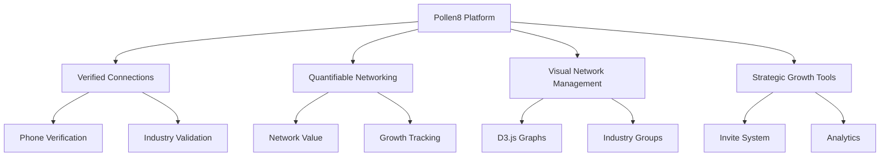
```mermaid
graph TD
    A[Pollen8 Platform] --> B[Verified Connections]
    A --> C[Quantifiable Networking]
    A --> D[Visual Network Management]
    A --> E[Strategic Growth Tools]
    
    B --> F[Phone Verification]
    B --> G[Industry Validation]
    
    C --> H[Network Value]
    C --> I[Growth Tracking]
    
    D --> J[D3.js Graphs]
    D --> K[Industry Groups]
    
    E --> L[Invite System]
    E --> M[Analytics]
```

## 1.2 Scope

### Product Overview
Pollen8 is a web-based professional networking platform built on modern technologies:
- Frontend: React.js with Tailwind CSS
- Backend: Node.js
- Visualization: D3.js
- Design: Minimalist black and white aesthetic

### Core Functionalities

1. User Authentication and Profile Creation
   - Phone number verification
   - Minimum 3 industry selections
   - Minimum 3 interest selections
   - Location-based profile enhancement

2. Network Management
   - Visual network mapping
   - Industry-specific networking
   - Connection value calculation
   - Growth tracking and analytics

3. Invite and Growth System
   - Unique link generation
   - Click tracking
   - Activity visualization
   - Network expansion analytics

### Benefits

| Stakeholder | Benefits |
|-------------|----------|
| Professionals | - Verified, high-quality connections<br>- Quantifiable network growth<br>- Industry-focused networking |
| Businesses | - Talent pool access<br>- Industry network insights<br>- Strategic connection building |
| Platform | - Data-driven growth<br>- Scalable architecture<br>- Engagement analytics |

### Limitations and Constraints

1. Technical Constraints
   - Web platform only (no native mobile apps)
   - Black and white design aesthetic
   - Proxima Nova font requirement

2. Functional Constraints
   - Phone number required for registration
   - Minimum industry/interest selections
   - Location-based functionality

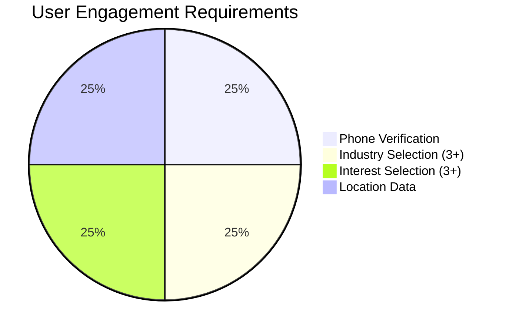
```mermaid
pie title User Engagement Requirements
    "Phone Verification" : 100
    "Industry Selection (3+)" : 100
    "Interest Selection (3+)" : 100
    "Location Data" : 100
```

### Future Expansion Possibilities
1. Mobile application development
2. API integrations with other professional platforms
3. Advanced analytics and machine learning features
4. Enterprise-level networking tools

# 2. SYSTEM ARCHITECTURE

## 2.1 PROGRAMMING LANGUAGES

| Language | Purpose | Justification |
|----------|---------|---------------|
| JavaScript/TypeScript | Frontend Development | - React.js ecosystem compatibility<br>- Rich library support including D3.js<br>- TypeScript adds static typing for improved reliability |
| Node.js | Backend Development | - JavaScript consistency across stack<br>- High performance for real-time features<br>- Extensive package ecosystem |
| CSS (Tailwind) | Styling | - Utility-first approach for consistent design<br>- Highly customizable for black/white theme<br>- Optimal for responsive layouts |
| SQL | Database Queries | - Robust data integrity for relational data<br>- Complex querying for analytics<br>- Industry standard for data management |

## 2.2 HIGH-LEVEL ARCHITECTURE DIAGRAM

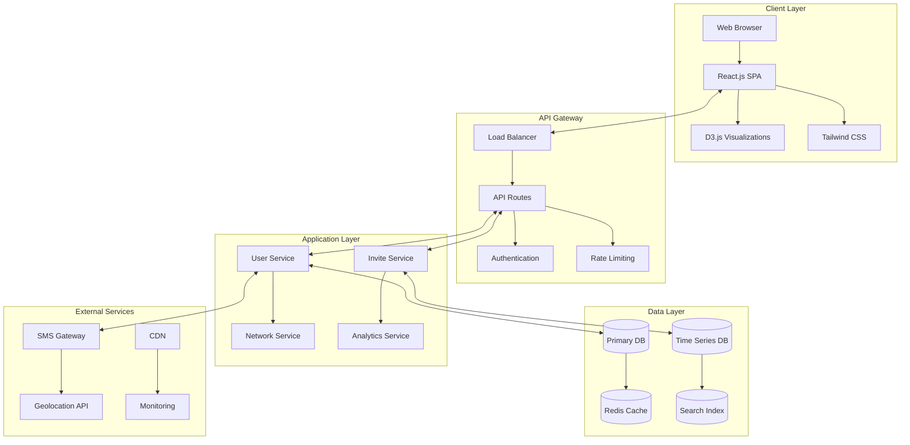
```mermaid
graph TB
    subgraph Client Layer
        A[Web Browser] --> B[React.js SPA]
        B --> C[D3.js Visualizations]
        B --> D[Tailwind CSS]
    end
    
    subgraph API Gateway
        E[Load Balancer] --> F[API Routes]
        F --> G[Authentication]
        F --> H[Rate Limiting]
    end
    
    subgraph Application Layer
        I[User Service] --> J[Network Service]
        K[Invite Service] --> L[Analytics Service]
    end
    
    subgraph Data Layer
        M[(Primary DB)] --> N[(Redis Cache)]
        O[(Time Series DB)] --> P[(Search Index)]
    end
    
    subgraph External Services
        Q[SMS Gateway] --> R[Geolocation API]
        S[CDN] --> T[Monitoring]
    end
    
    B <--> E
    F <--> I
    F <--> K
    I <--> M
    K <--> O
    I <--> Q
```

## 2.3 COMPONENT DIAGRAMS

### 2.3.1 Frontend Components

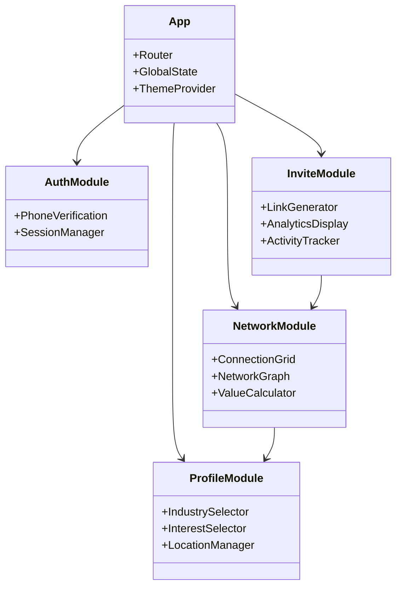
```mermaid
classDiagram
    class App {
        +Router
        +GlobalState
        +ThemeProvider
    }
    class AuthModule {
        +PhoneVerification
        +SessionManager
    }
    class ProfileModule {
        +IndustrySelector
        +InterestSelector
        +LocationManager
    }
    class NetworkModule {
        +ConnectionGrid
        +NetworkGraph
        +ValueCalculator
    }
    class InviteModule {
        +LinkGenerator
        +AnalyticsDisplay
        +ActivityTracker
    }
    
    App --> AuthModule
    App --> ProfileModule
    App --> NetworkModule
    App --> InviteModule
    NetworkModule --> ProfileModule
    InviteModule --> NetworkModule
```

### 2.3.2 Backend Components

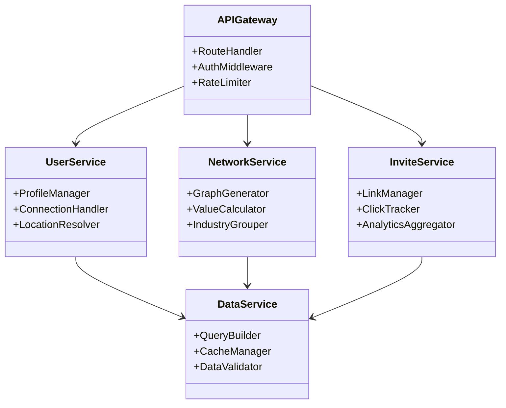
```mermaid
classDiagram
    class APIGateway {
        +RouteHandler
        +AuthMiddleware
        +RateLimiter
    }
    class UserService {
        +ProfileManager
        +ConnectionHandler
        +LocationResolver
    }
    class NetworkService {
        +GraphGenerator
        +ValueCalculator
        +IndustryGrouper
    }
    class InviteService {
        +LinkManager
        +ClickTracker
        +AnalyticsAggregator
    }
    class DataService {
        +QueryBuilder
        +CacheManager
        +DataValidator
    }
    
    APIGateway --> UserService
    APIGateway --> NetworkService
    APIGateway --> InviteService
    UserService --> DataService
    NetworkService --> DataService
    InviteService --> DataService
```

## 2.4 SEQUENCE DIAGRAMS

### 2.4.1 User Onboarding Flow

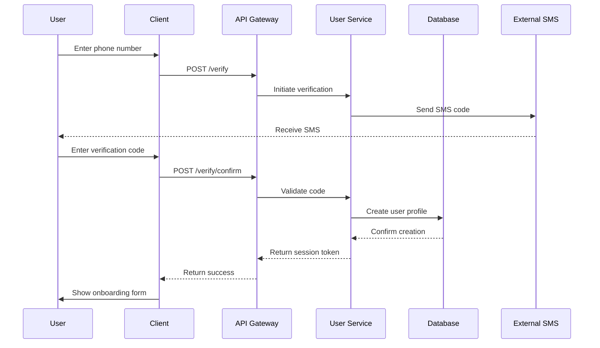
```mermaid
sequenceDiagram
    participant U as User
    participant C as Client
    participant A as API Gateway
    participant S as User Service
    participant D as Database
    participant E as External SMS

    U->>C: Enter phone number
    C->>A: POST /verify
    A->>S: Initiate verification
    S->>E: Send SMS code
    E-->>U: Receive SMS
    U->>C: Enter verification code
    C->>A: POST /verify/confirm
    A->>S: Validate code
    S->>D: Create user profile
    D-->>S: Confirm creation
    S-->>A: Return session token
    A-->>C: Return success
    C->>U: Show onboarding form
```

### 2.4.2 Network Visualization Generation

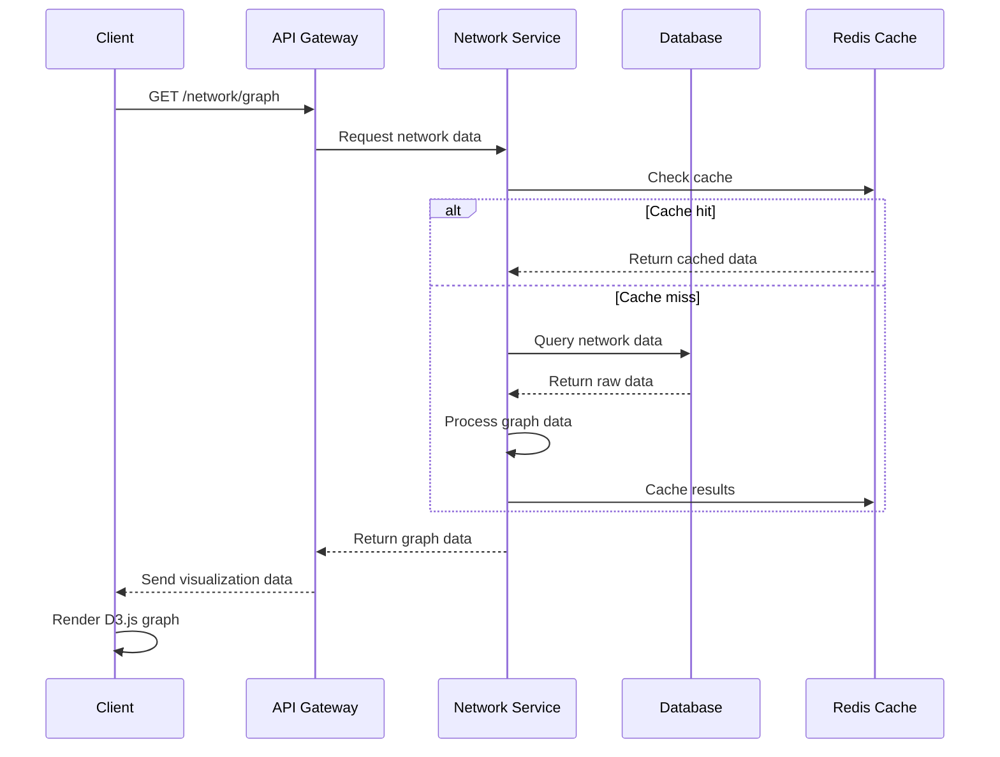
```mermaid
sequenceDiagram
    participant C as Client
    participant A as API Gateway
    participant N as Network Service
    participant D as Database
    participant R as Redis Cache

    C->>A: GET /network/graph
    A->>N: Request network data
    N->>R: Check cache
    alt Cache hit
        R-->>N: Return cached data
    else Cache miss
        N->>D: Query network data
        D-->>N: Return raw data
        N->>N: Process graph data
        N->>R: Cache results
    end
    N-->>A: Return graph data
    A-->>C: Send visualization data
    C->>C: Render D3.js graph
```

## 2.5 DATA-FLOW DIAGRAM

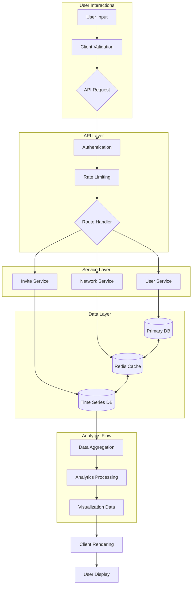
```mermaid
flowchart TD
    subgraph User Interactions
        A[User Input] --> B[Client Validation]
        B --> C{API Request}
    end
    
    subgraph API Layer
        C --> D[Authentication]
        D --> E[Rate Limiting]
        E --> F{Route Handler}
    end
    
    subgraph Service Layer
        F --> G[User Service]
        F --> H[Network Service]
        F --> I[Invite Service]
    end
    
    subgraph Data Layer
        G --> J[(Primary DB)]
        H --> K[(Redis Cache)]
        I --> L[(Time Series DB)]
        
        J <--> K
        K <--> L
    end
    
    subgraph Analytics Flow
        L --> M[Data Aggregation]
        M --> N[Analytics Processing]
        N --> O[Visualization Data]
    end
    
    O --> P[Client Rendering]
    P --> Q[User Display]
```

### 2.5.1 Data Flow Specifications

| Flow Type | Source | Destination | Format | Frequency |
|-----------|--------|-------------|--------|-----------|
| User Data | Client | API Gateway | JSON/HTTPS | On user action |
| Network Data | Database | Network Service | Binary/Internal | Real-time |
| Cache Data | Services | Redis | Key-Value | Sub-millisecond |
| Analytics | Time Series DB | Analytics Service | JSON/Internal | Batch (hourly) |
| Visualizations | Network Service | Client | JSON/WebSocket | On-demand |

# 3. SYSTEM DESIGN

## 3.1 PROGRAMMING LANGUAGES

| Language | Purpose | Justification |
|----------|---------|---------------|
| TypeScript | Frontend Development | - Extends JavaScript with static typing for enhanced reliability<br>- Excellent tooling and IDE support<br>- Seamless integration with React.js ecosystem |
| Node.js | Backend Development | - JavaScript runtime for server-side execution<br>- Large package ecosystem via npm<br>- Efficient handling of concurrent connections |
| CSS (Tailwind) | Styling | - Utility-first approach for rapid UI development<br>- Built-in responsive design capabilities<br>- Easy customization for black/white theme |
| SQL (PostgreSQL) | Database | - Robust relational data model for complex relationships<br>- ACID compliance for data integrity<br>- Powerful querying capabilities for analytics |

## 3.2 DATABASE DESIGN

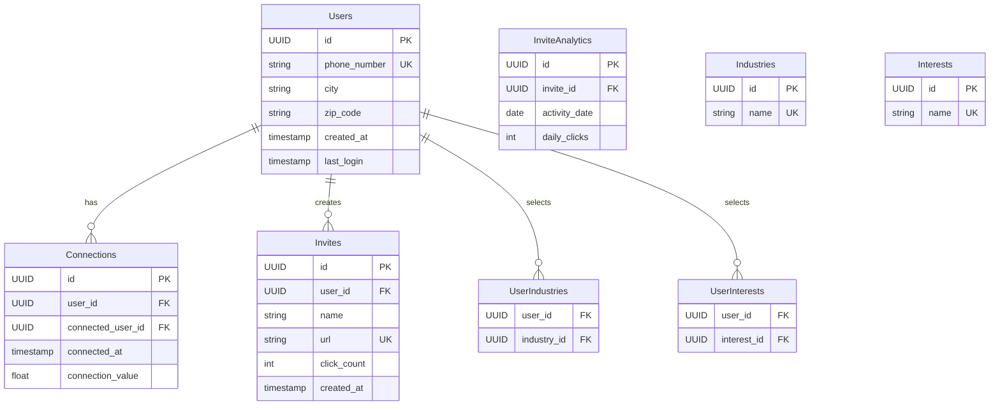
```mermaid
erDiagram
    Users ||--o{ Connections : has
    Users ||--o{ Invites : creates
    Users ||--o{ UserIndustries : selects
    Users ||--o{ UserInterests : selects
    Users {
        UUID id PK
        string phone_number UK
        string city
        string zip_code
        timestamp created_at
        timestamp last_login
    }
    Connections {
        UUID id PK
        UUID user_id FK
        UUID connected_user_id FK
        timestamp connected_at
        float connection_value
    }
    Invites {
        UUID id PK
        UUID user_id FK
        string name
        string url UK
        int click_count
        timestamp created_at
    }
    InviteAnalytics {
        UUID id PK
        UUID invite_id FK
        date activity_date
        int daily_clicks
    }
    Industries {
        UUID id PK
        string name UK
    }
    Interests {
        UUID id PK
        string name UK
    }
    UserIndustries {
        UUID user_id FK
        UUID industry_id FK
    }
    UserInterests {
        UUID user_id FK
        UUID interest_id FK
    }
```

### Database Indexes

| Table | Index | Type | Purpose |
|-------|-------|------|---------|
| Users | phone_number | Unique | Fast lookup during authentication |
| Invites | url | Unique | Ensure unique invite links |
| Connections | (user_id, connected_user_id) | Composite | Optimize network queries |
| InviteAnalytics | (invite_id, activity_date) | Composite | Efficient analytics retrieval |

## 3.3 API DESIGN

### RESTful Endpoints

| Endpoint | Method | Purpose | Request Body | Response |
|----------|--------|---------|--------------|----------|
| `/api/auth/verify` | POST | Initiate phone verification | `{ phone: string }` | `{ verificationId: string }` |
| `/api/auth/confirm` | POST | Confirm verification code | `{ verificationId: string, code: string }` | `{ token: string, user: User }` |
| `/api/profile` | PUT | Update user profile | `{ industries: string[], interests: string[], zipCode: string }` | `{ user: User }` |
| `/api/invites` | POST | Generate invite link | `{ name: string }` | `{ invite: Invite }` |
| `/api/network` | GET | Fetch user network | - | `{ connections: Connection[], value: number }` |

### WebSocket Events

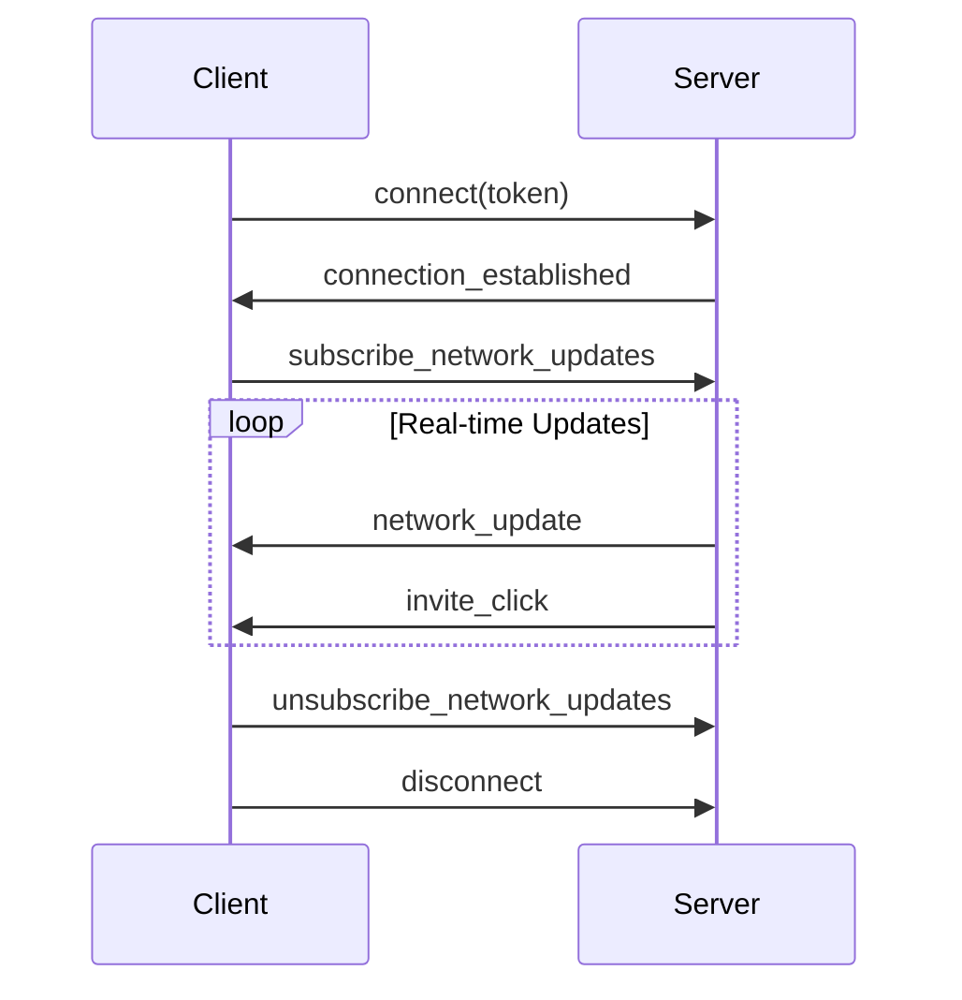
```mermaid
sequenceDiagram
    participant Client
    participant Server
    
    Client->>Server: connect(token)
    Server->>Client: connection_established
    
    Client->>Server: subscribe_network_updates
    
    loop Real-time Updates
        Server->>Client: network_update
        Server->>Client: invite_click
    end
    
    Client->>Server: unsubscribe_network_updates
    Client->>Server: disconnect
```

## 3.4 USER INTERFACE DESIGN

### Welcome Page

```
+----------------------------------+
|                                  |
|                                  |
|             POLLEN8              |
|                                  |
|          [GET CONNECTED]         |
|                                  |
|   +------------------------+     |
|   |     0000000           |     |
|   +------------------------+     |
|                                  |
|          [  VERIFY  ]            |
|                                  |
+----------------------------------+
```

### Onboarding Form

```
+----------------------------------+
|         Select Industries        |
|   +------------------------+     |
|   | [ ] Technology         |     |
|   | [ ] Healthcare         |     |
|   | [ ] Finance            |     |
|   +------------------------+     |
|                                  |
|         Select Interests         |
|   +------------------------+     |
|   | [ ] Sports             |     |
|   | [ ] Gaming             |     |
|   | [ ] Travel             |     |
|   +------------------------+     |
|                                  |
|         Enter ZIP Code           |
|   +------------------------+     |
|   |     10001             |     |
|   +------------------------+     |
|                                  |
|          [  ONBOARD  ]           |
+----------------------------------+
```

## 3.5 THEME DESIGN

### Color Palette

| Element | Color | Hex Code |
|---------|-------|----------|
| Background | Black | #000000 |
| Primary Text | White | #FFFFFF |
| Secondary Text | Light Gray | #EFEFEF |
| Accent | White | #FFFFFF |

### Typography

| Element | Font | Size | Weight |
|---------|------|------|--------|
| Headers | Proxima Nova | 30px (H1), 25px (H2), 20px (H3) | 600 |
| Body Text | Proxima Nova | 14px | 300 |
| Buttons | Proxima Nova | 16px | 600 |
| Form Fields | Proxima Nova | 18px | 600 |

### UI Components

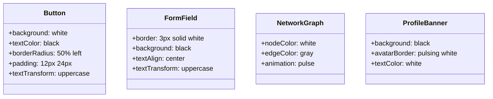
```mermaid
classDiagram
    class Button {
        +background: white
        +textColor: black
        +borderRadius: 50% left
        +padding: 12px 24px
        +textTransform: uppercase
    }
    class FormField {
        +border: 3px solid white
        +background: black
        +textAlign: center
        +textTransform: uppercase
    }
    class NetworkGraph {
        +nodeColor: white
        +edgeColor: gray
        +animation: pulse
    }
    class ProfileBanner {
        +background: black
        +avatarBorder: pulsing white
        +textColor: white
    }
```

### Animation Specifications

| Element | Animation | Duration | Timing Function |
|---------|-----------|----------|-----------------|
| Page Transition | Fade | 300ms | ease-in-out |
| Button Hover | Scale | 200ms | ease |
| Verification Pulse | Ring Pulse | 4000ms | ease-in-out |
| Network Graph | Force Simulation | Continuous | n/a |

# 4. TECHNOLOGY STACK

## 4.1 PROGRAMMING LANGUAGES

| Language | Version | Purpose | Justification |
|----------|---------|---------|---------------|
| TypeScript | 4.9+ | Frontend & Backend Development | - Strong typing for enhanced reliability and maintainability<br>- Seamless integration with React ecosystem<br>- Consistent language across full stack<br>- Superior tooling and IDE support |
| CSS | Tailwind 3.0+ | Styling | - Utility-first approach aligns with rapid development needs<br>- Built-in responsive design capabilities<br>- Highly customizable for black/white theme<br>- Optimal performance with minimal CSS output |
| SQL | PostgreSQL 14+ | Database Queries | - Robust handling of relational data for network connections<br>- Strong data integrity and ACID compliance<br>- Powerful querying capabilities for complex analytics<br>- Excellent performance for large datasets |

## 4.2 FRAMEWORKS AND LIBRARIES

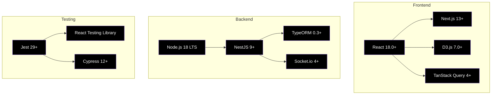
```mermaid
graph TB
    subgraph Frontend
        A[React 18.0+] --> B[Next.js 13+]
        A --> C[D3.js 7.0+]
        A --> D[TanStack Query 4+]
        style A fill:#000,color:#fff
        style B fill:#000,color:#fff
        style C fill:#000,color:#fff
        style D fill:#000,color:#fff
    end
    
    subgraph Backend
        E[Node.js 18 LTS] --> F[NestJS 9+]
        F --> G[TypeORM 0.3+]
        F --> H[Socket.io 4+]
        style E fill:#000,color:#fff
        style F fill:#000,color:#fff
        style G fill:#000,color:#fff
        style H fill:#000,color:#fff
    end
    
    subgraph Testing
        I[Jest 29+] --> J[React Testing Library]
        I --> K[Cypress 12+]
        style I fill:#000,color:#fff
        style J fill:#000,color:#fff
        style K fill:#000,color:#fff
    end
```

### Framework Justifications

| Framework/Library | Purpose | Key Benefits |
|-------------------|---------|--------------|
| React 18.0+ | Frontend UI | - Concurrent rendering for improved performance<br>- Rich ecosystem of compatible libraries<br>- Server components for optimal loading |
| Next.js 13+ | React Framework | - Server-side rendering for SEO and performance<br>- API routes for backend functionality<br>- Optimized image handling and performance |
| D3.js 7.0+ | Data Visualization | - Powerful network graph rendering<br>- Smooth animations for interactive visualizations<br>- Customizable to match black/white theme |
| NestJS 9+ | Backend Framework | - TypeScript-native architecture<br>- Modular structure for scalability<br>- Built-in support for WebSockets |
| TanStack Query 4+ | Data Fetching | - Efficient server state management<br>- Automatic background data updates<br>- Optimistic UI updates |

## 4.3 DATABASES

| Database | Version | Purpose | Key Features |
|----------|---------|---------|--------------|
| PostgreSQL | 14+ | Primary Database | - Network graph data storage<br>- Complex querying for analytics<br>- JSONB support for flexible data |
| Redis | 6.2+ | Caching & Sessions | - High-performance caching<br>- Session management<br>- Real-time leaderboards |
| TimeScale | 2.8+ | Time-Series Data | - Efficient storage of network growth data<br>- Advanced time-based analytics<br>- PostgreSQL compatibility |

### Database Schema Overview

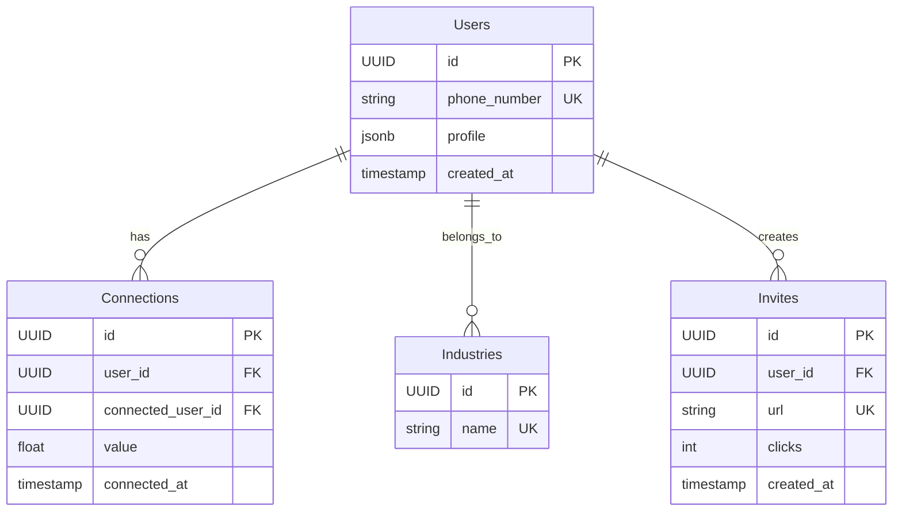
```mermaid
erDiagram
    Users ||--o{ Connections : has
    Users ||--o{ Industries : belongs_to
    Users ||--o{ Invites : creates
    Users {
        UUID id PK
        string phone_number UK
        jsonb profile
        timestamp created_at
    }
    Connections {
        UUID id PK
        UUID user_id FK
        UUID connected_user_id FK
        float value
        timestamp connected_at
    }
    Industries {
        UUID id PK
        string name UK
    }
    Invites {
        UUID id PK
        UUID user_id FK
        string url UK
        int clicks
        timestamp created_at
    }
```

## 4.4 THIRD-PARTY SERVICES

| Service | Purpose | Integration Method | Key Features |
|---------|---------|-------------------|--------------|
| Twilio | Phone Verification | REST API | - SMS verification codes<br>- Phone number validation<br>- Global coverage |
| AWS S3 | Asset Storage | SDK | - Profile image storage<br>- Scalable and reliable<br>- CDN integration |
| Stripe | Payment Processing | SDK & Webhooks | - Subscription management<br>- Secure payment handling<br>- Comprehensive dashboard |
| Sentry | Error Tracking | SDK | - Real-time error monitoring<br>- Performance tracking<br>- Issue prioritization |
| DataDog | Monitoring | Agent & API | - Infrastructure monitoring<br>- APM for performance tracking<br>- Custom metrics |

### Service Architecture

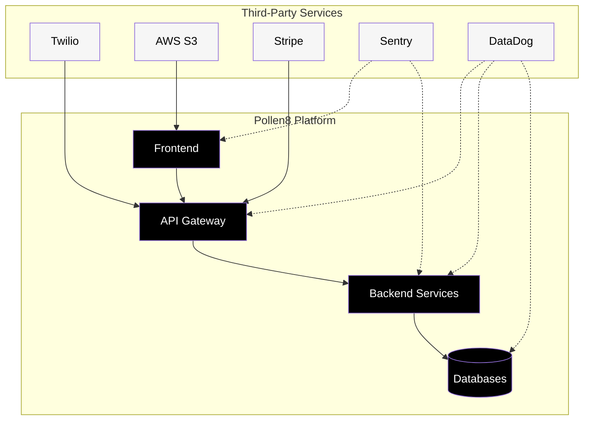
```mermaid
graph TB
    subgraph Pollen8 Platform
        A[Frontend] --> B[API Gateway]
        B --> C[Backend Services]
        C --> D[(Databases)]
    end
    
    subgraph Third-Party Services
        E[Twilio] --> B
        F[AWS S3] --> A
        G[Stripe] --> B
        H[Sentry] -.-> A & C
        I[DataDog] -.-> B & C & D
    end
    
    style A fill:#000,color:#fff
    style B fill:#000,color:#fff
    style C fill:#000,color:#fff
    style D fill:#000,color:#fff
    style E fill:#f6f6f6,color:#000
    style F fill:#f6f6f6,color:#000
    style G fill:#f6f6f6,color:#000
    style H fill:#f6f6f6,color:#000
    style I fill:#f6f6f6,color:#000
```

# 9. SECURITY CONSIDERATIONS

## 9.1 AUTHENTICATION AND AUTHORIZATION

### 9.1.1 Authentication Flow

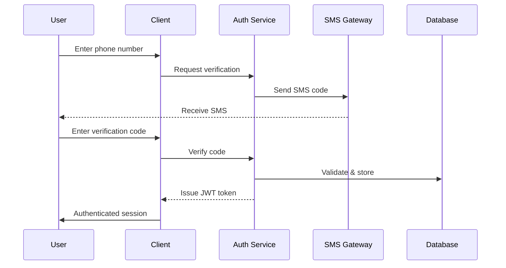
```mermaid
sequenceDiagram
    participant U as User
    participant C as Client
    participant A as Auth Service
    participant S as SMS Gateway
    participant D as Database

    U->>C: Enter phone number
    C->>A: Request verification
    A->>S: Send SMS code
    S-->>U: Receive SMS
    U->>C: Enter verification code
    C->>A: Verify code
    A->>D: Validate & store
    A-->>C: Issue JWT token
    C->>U: Authenticated session
```

### 9.1.2 Authorization Levels

| Role | Permissions | Access Scope |
|------|-------------|--------------|
| Unverified User | - View public landing page | Limited to pre-authentication pages |
| Verified User | - Create/edit profile<br>- Manage connections<br>- Generate invites<br>- View network analytics | Full platform access for own data |
| Admin | - All verified user permissions<br>- Access admin dashboard<br>- Manage user accounts<br>- View platform analytics | Full platform access including admin features |

### 9.1.3 Token Management

| Token Type | Purpose | Expiration | Refresh Strategy |
|------------|---------|------------|------------------|
| JWT Access Token | API authentication | 1 hour | Using refresh token |
| Refresh Token | Obtain new access token | 7 days | Re-authentication required |
| Invite Token | Unique invite links | 30 days | Generate new invite |

## 9.2 DATA SECURITY

### 9.2.1 Encryption Standards

| Data Type | At Rest | In Transit | Key Management |
|-----------|----------|------------|----------------|
| User Credentials | AES-256 | TLS 1.3 | AWS KMS |
| Phone Numbers | Hashed (bcrypt) | TLS 1.3 | N/A |
| Profile Data | AES-256 | TLS 1.3 | AWS KMS |
| Connection Data | AES-256 | TLS 1.3 | AWS KMS |

### 9.2.2 Data Access Controls

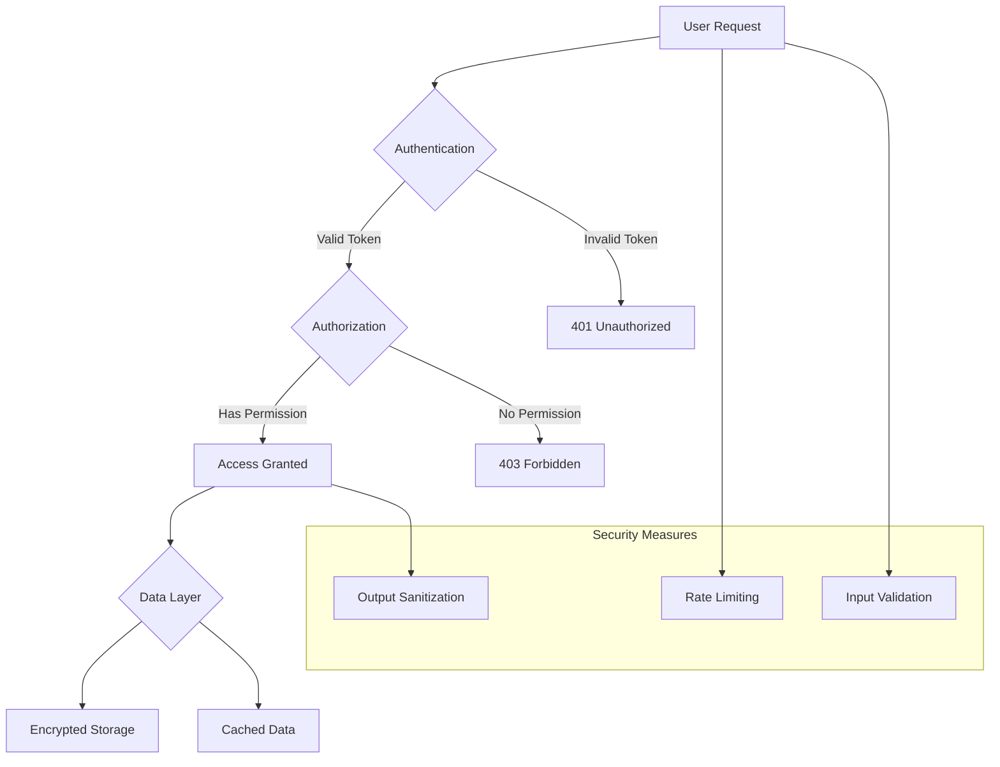
```mermaid
graph TD
    A[User Request] --> B{Authentication}
    B -->|Valid Token| C{Authorization}
    B -->|Invalid Token| D[401 Unauthorized]
    C -->|Has Permission| E[Access Granted]
    C -->|No Permission| F[403 Forbidden]
    
    E --> G{Data Layer}
    G --> H[Encrypted Storage]
    G --> I[Cached Data]
    
    subgraph Security Measures
    J[Rate Limiting]
    K[Input Validation]
    L[Output Sanitization]
    end
    
    A --> J
    A --> K
    E --> L
```

### 9.2.3 Database Security

| Measure | Implementation | Purpose |
|---------|----------------|---------|
| Connection Pooling | MongoDB connection manager | Prevent connection leaks |
| Query Parameterization | Mongoose ORM | Prevent injection attacks |
| Least Privilege Access | Role-based DB users | Minimize attack surface |
| Audit Logging | MongoDB Audit Log | Track data access and changes |

## 9.3 SECURITY PROTOCOLS

### 9.3.1 API Security

| Protocol | Implementation | Description |
|----------|----------------|-------------|
| Rate Limiting | Express-rate-limit middleware | 100 requests per minute per IP |
| CORS | Configured in Express.js | Whitelist of allowed origins |
| HTTP Headers | Helmet.js | Security headers including HSTS |
| Request Validation | Joi schema validation | Validate all incoming requests |

### 9.3.2 Monitoring and Incident Response

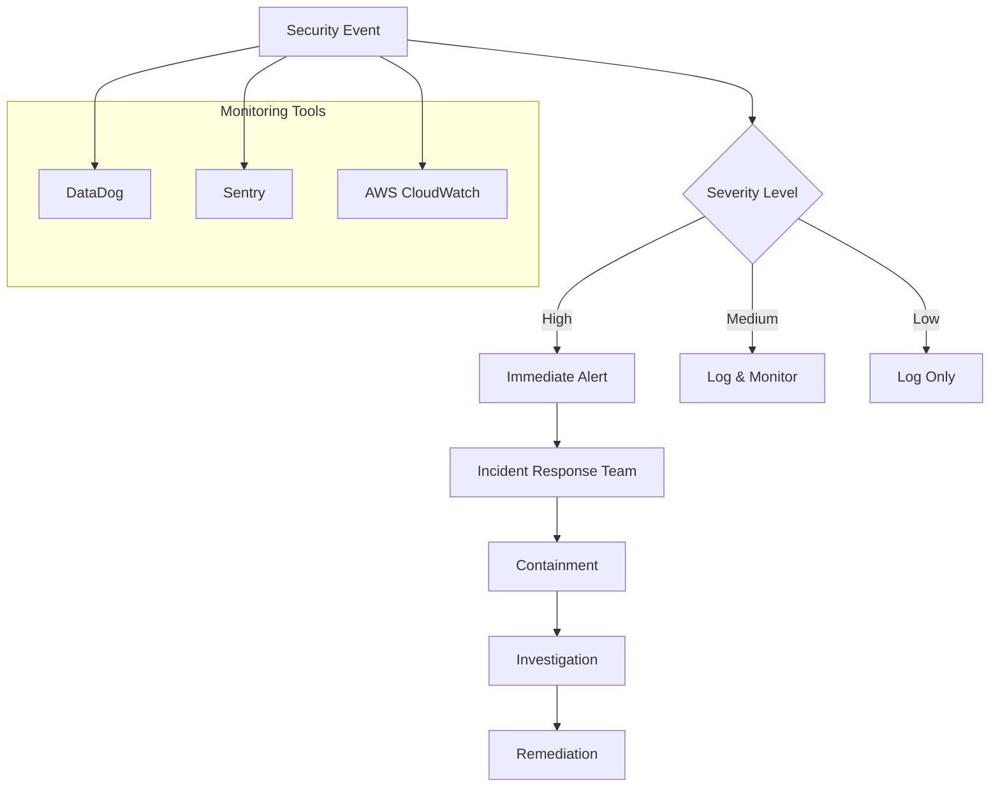
```mermaid
flowchart TD
    A[Security Event] --> B{Severity Level}
    B -->|High| C[Immediate Alert]
    B -->|Medium| D[Log & Monitor]
    B -->|Low| E[Log Only]
    
    C --> F[Incident Response Team]
    F --> G[Containment]
    G --> H[Investigation]
    H --> I[Remediation]
    
    subgraph Monitoring Tools
    J[DataDog]
    K[Sentry]
    L[AWS CloudWatch]
    end
    
    A --> J
    A --> K
    A --> L
```

### 9.3.3 Security Testing

| Test Type | Frequency | Tools | Responsibility |
|-----------|-----------|-------|----------------|
| Penetration Testing | Quarterly | Burp Suite, OWASP ZAP | External Security Firm |
| Vulnerability Scanning | Weekly | Snyk, SonarQube | DevOps Team |
| Dependency Auditing | Daily | npm audit, Dependabot | CI/CD Pipeline |
| Security Unit Tests | Per Commit | Jest, Supertest | Development Team |

### 9.3.4 Compliance and Best Practices

- OWASP Top 10 mitigation strategies implemented
- GDPR compliance for user data handling
- Regular security training for development team
- Bug bounty program for responsible disclosure

| Compliance Area | Standard/Framework | Implementation |
|-----------------|---------------------|----------------|
| Authentication | NIST 800-63B | Multi-factor authentication |
| Data Protection | GDPR Article 32 | Encryption, pseudonymization |
| Secure Development | OWASP ASVS | Security requirements checklist |
| Incident Response | ISO 27035 | Documented response procedures |

### 9.3.5 Security Configurations

```json
{
  "securityHeaders": {
    "strictTransportSecurity": "max-age=31536000; includeSubDomains",
    "contentSecurityPolicy": "default-src 'self'; script-src 'self'",
    "xFrameOptions": "DENY",
    "xContentTypeOptions": "nosniff",
    "referrerPolicy": "strict-origin-when-cross-origin"
  },
  "rateLimit": {
    "windowMs": 60000,
    "max": 100
  },
  "cors": {
    "origin": ["https://pollen8.com"],
    "methods": ["GET", "POST", "PUT", "DELETE"],
    "allowedHeaders": ["Content-Type", "Authorization"]
  }
}
```

# 5. INFRASTRUCTURE

## 5.1 DEPLOYMENT ENVIRONMENT

Pollen8 utilizes a cloud-native deployment strategy to ensure scalability, reliability, and optimal performance.

| Environment | Purpose | Configuration |
|-------------|---------|---------------|
| Development | Local development and testing | Docker containers on developer machines |
| Staging | Pre-production testing and QA | AWS EKS cluster with replicated production setup |
| Production | Live user-facing environment | Multi-AZ AWS EKS deployment with high availability |

### Environment Architecture

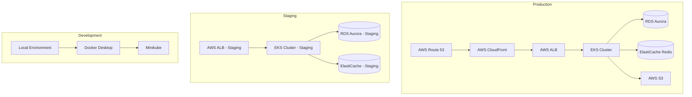
```mermaid
graph TB
    subgraph Production
        A[AWS Route 53] --> B[AWS CloudFront]
        B --> C[AWS ALB]
        C --> D[EKS Cluster]
        D --> E[(RDS Aurora)]
        D --> F[(ElastiCache Redis)]
        D --> G[AWS S3]
    end
    
    subgraph Staging
        H[AWS ALB - Staging] --> I[EKS Cluster - Staging]
        I --> J[(RDS Aurora - Staging)]
        I --> K[(ElastiCache - Staging)]
    end
    
    subgraph Development
        L[Local Environment] --> M[Docker Desktop]
        M --> N[Minikube]
    end
```

## 5.2 CLOUD SERVICES

| Service | Purpose | Justification |
|---------|---------|---------------|
| AWS EKS | Container orchestration | Native Kubernetes support, high availability |
| AWS RDS Aurora | Database | Compatible with PostgreSQL, automatic scaling |
| AWS ElastiCache | Caching layer | Redis compatibility, sub-millisecond latency |
| AWS CloudFront | CDN | Global edge locations, low latency content delivery |
| AWS Route 53 | DNS management | Health checking, latency-based routing |
| AWS S3 | Static asset storage | Durability, integration with CloudFront |

## 5.3 CONTAINERIZATION

Pollen8 uses Docker for containerization to ensure consistency across environments and simplified deployment.

### Container Strategy

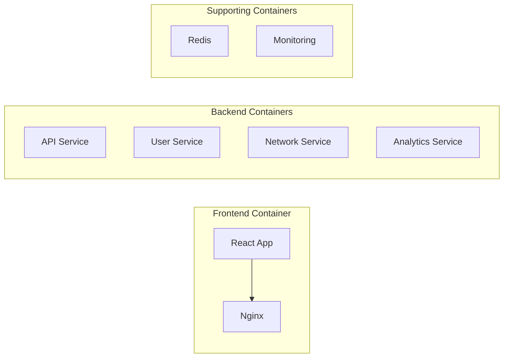
```mermaid
graph LR
    subgraph Frontend Container
        A[React App] --> B[Nginx]
    end
    
    subgraph Backend Containers
        C[API Service]
        D[User Service]
        E[Network Service]
        F[Analytics Service]
    end
    
    subgraph Supporting Containers
        G[Redis]
        H[Monitoring]
    end
```

### Dockerfile Examples

```dockerfile
# Frontend Dockerfile
FROM node:18-alpine AS builder
WORKDIR /app
COPY package*.json ./
RUN npm install
COPY . .
RUN npm run build

FROM nginx:alpine
COPY --from=builder /app/build /usr/share/nginx/html
COPY nginx.conf /etc/nginx/conf.d/default.conf
EXPOSE 80
CMD ["nginx", "-g", "daemon off;"]

# Backend Dockerfile
FROM node:18-alpine
WORKDIR /app
COPY package*.json ./
RUN npm install
COPY . .
EXPOSE 3000
CMD ["npm", "start"]
```

## 5.4 ORCHESTRATION

Kubernetes is used for container orchestration, managed through AWS EKS.

### Kubernetes Resources

| Resource | Purpose | Configuration |
|----------|---------|---------------|
| Deployments | Manage application pods | Rolling updates, auto-scaling |
| Services | Internal networking | Load balancing, service discovery |
| Ingress | External access | SSL termination, routing rules |
| ConfigMaps | Configuration | Environment-specific settings |
| Secrets | Sensitive data | Encrypted credentials storage |

### Cluster Architecture

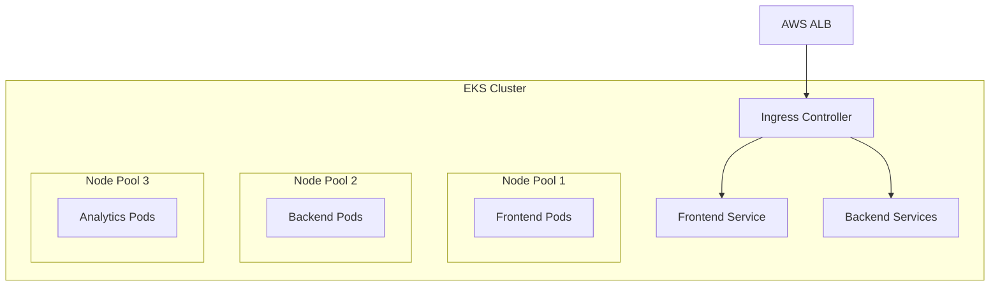
```mermaid
graph TB
    subgraph EKS Cluster
        A[Ingress Controller] --> B[Frontend Service]
        A --> C[Backend Services]
        
        subgraph Node Pool 1
            D[Frontend Pods]
        end
        
        subgraph Node Pool 2
            E[Backend Pods]
        end
        
        subgraph Node Pool 3
            F[Analytics Pods]
        end
    end
    
    G[AWS ALB] --> A
```

## 5.5 CI/CD PIPELINE

### Pipeline Overview

```mermaid
graph LR
    A[Git Push] --> B[GitHub Actions]
    B --> C{Tests Pass?}
    C -->|Yes| D[Build Containers]
    C -->|No| E[Notify Team]
    D --> F[Push to ECR]
    F --> G{Production?}
    G -->|Yes| H[Manual Approval]
    G -->|No| I[Deploy to Staging]
    H --> J[Deploy to Production]
    I --> K[Integration Tests]
    K -->|Pass| L[Ready for Production]
    K -->|Fail| M[Rollback]
```

### CI/CD Components

| Component | Tool | Purpose |
|-----------|------|---------|
| Source Control | GitHub | Version control, collaboration |
| CI Platform | GitHub Actions | Automated testing, building |
| Container Registry | AWS ECR | Store Docker images |
| Deployment Tool | ArgoCD | GitOps-based deployments |
| Monitoring | Datadog | Performance and error tracking |

### Deployment Strategy

1. Blue-Green Deployments
   - Maintain two identical production environments
   - Switch traffic after successful deployment
   - Enable instant rollback if needed

2. Automated Canary Analysis
   - Deploy to 5% of users initially
   - Gradually increase based on metrics
   - Automatic rollback if errors detected

### Example GitHub Actions Workflow

```yaml
name: CI/CD Pipeline

on:
  push:
    branches: [ main, develop ]
  pull_request:
    branches: [ main ]

jobs:
  test:
    runs-on: ubuntu-latest
    steps:
      - uses: actions/checkout@v2
      - name: Run tests
        run: npm test

  build:
    needs: test
    runs-on: ubuntu-latest
    steps:
      - uses: actions/checkout@v2
      - name: Build and push Docker image
        uses: docker/build-push-action@v2
        with:
          push: true
          tags: ${{ secrets.ECR_REGISTRY }}/pollen8:${{ github.sha }}

  deploy:
    needs: build
    runs-on: ubuntu-latest
    steps:
      - uses: actions/checkout@v2
      - name: Deploy to EKS
        uses: aws-actions/amazon-eks-deploy@v1
        with:
          cluster-name: pollen8-cluster
          image: ${{ secrets.ECR_REGISTRY }}/pollen8:${{ github.sha }}
```

# 8. APPENDICES

## 8.1 Additional Technical Information

### 8.1.1 Browser Compatibility

| Browser | Minimum Version | Notes |
|---------|-----------------|-------|
| Chrome | 83+ | Full support for all features |
| Firefox | 78+ | Limited D3.js animation performance |
| Safari | 13+ | Requires WebKit prefixes for some CSS |
| Edge | 84+ | Full support for all features |

### 8.1.2 Performance Benchmarks

```mermaid
gantt
    title Page Load Time Breakdown
    dateFormat  s
    axisFormat %S

    section Critical Path
    DNS Lookup      :a1, 0, 0.1s
    TCP Connection  :a2, after a1, 0.2s
    TLS Handshake   :a3, after a2, 0.3s
    TTFB            :a4, after a3, 0.4s
    Content Download:a5, after a4, 0.5s
    JS Execution    :a6, after a5, 0.4s
    D3.js Render    :a7, after a6, 0.6s
```

### 8.1.3 Third-Party Dependencies

| Dependency | Version | Purpose | License |
|------------|---------|---------|---------|
| Axios | 0.27+ | HTTP client | MIT |
| Lodash | 4.17+ | Utility functions | MIT |
| date-fns | 2.28+ | Date manipulation | MIT |
| uuid | 8.3+ | Unique ID generation | MIT |

## 8.2 GLOSSARY

| Term | Definition |
|------|------------|
| Circuit Breaker | Design pattern that prevents cascading failures by stopping operations when a threshold of failures is reached |
| Hot Reload | Development feature that updates code changes without full page refresh |
| Hydration | Process of attaching JavaScript event listeners to server-rendered HTML |
| Lazy Loading | Technique to defer loading of non-critical resources until needed |
| Memoization | Optimization technique that stores results of expensive operations |
| Microfrontend | Architectural style where frontend apps are composed from independent components |
| Server-Side Rendering | Generating HTML on the server for improved initial page load |
| Time to Interactive | Metric measuring when a page becomes fully interactive |
| Tree Shaking | Removing unused code from the final bundle |
| Zero-Config | Development setup that works out of the box without manual configuration |

## 8.3 ACRONYMS

| Acronym | Full Form | Context |
|---------|-----------|---------|
| A11Y | Accessibility | Web development standard for inclusive design |
| AJAX | Asynchronous JavaScript and XML | Web development technique for async data exchange |
| CORS | Cross-Origin Resource Sharing | Security feature controlling resource access |
| CSP | Content Security Policy | Security layer preventing XSS attacks |
| DDD | Domain-Driven Design | Software design approach focusing on domain logic |
| DRY | Don't Repeat Yourself | Programming principle promoting code reuse |
| E2E | End-to-End | Testing approach covering entire application flow |
| I18N | Internationalization | Process of designing for multiple languages |
| IIFE | Immediately Invoked Function Expression | JavaScript pattern for scoping and privacy |
| JAMstack | JavaScript, APIs, and Markup | Modern web development architecture |
| JWT | JSON Web Token | Standard for secure information transmission |
| L10N | Localization | Adapting content for specific regions |
| MVC | Model-View-Controller | Software design pattern separating concerns |
| NPM | Node Package Manager | Package management for Node.js |
| ORM | Object-Relational Mapping | Technique for converting data between systems |
| PWA | Progressive Web App | Web app with native-like capabilities |
| REPL | Read-Eval-Print Loop | Interactive programming environment |
| SEO | Search Engine Optimization | Practices improving search visibility |
| SPA | Single Page Application | Web app updating without full page reloads |
| SSG | Static Site Generation | Pre-rendering pages at build time |
| SSR | Server-Side Rendering | Generating HTML on the server |
| TTL | Time To Live | Duration before cached data expires |
| TTFB | Time To First Byte | Performance metric for server response |
| URI | Uniform Resource Identifier | String identifying a web resource |
| UX | User Experience | Overall experience of using the application |
| WCAG | Web Content Accessibility Guidelines | Standards for web accessibility |
| XHR | XMLHttpRequest | API for data transfer between client and server |
| XSS | Cross-Site Scripting | Security vulnerability in web applications |