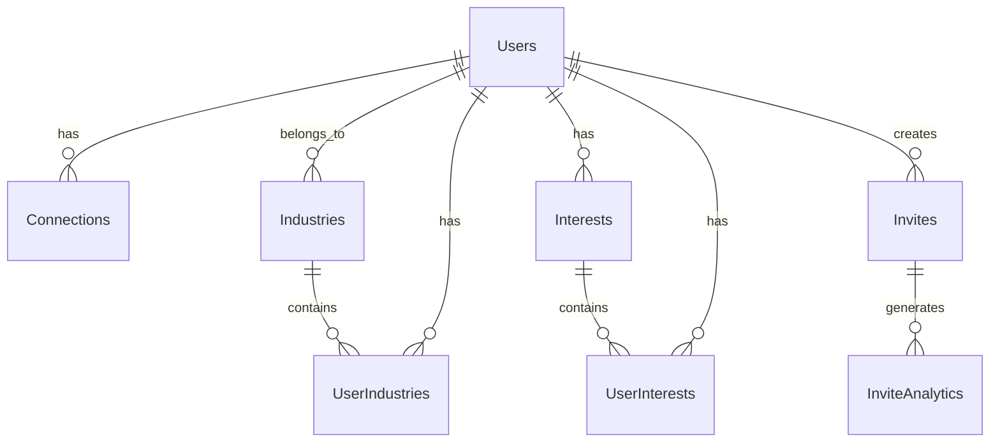

# Pollen8 Database Documentation

This README file provides essential information about the database structure, setup, and management for the Pollen8 platform.

## Database Overview

This section provides a high-level overview of the Pollen8 database structure and management.

### Entity Relationship Diagram



### Core Entities

1. Users: Stores user profile information
2. Industries: Predefined list of industries
3. Interests: Predefined list of interests
4. Connections: Represents connections between users
5. Invites: Tracks invite links generated by users
6. InviteAnalytics: Stores analytics data for invites

## Database Setup

To set up the Pollen8 database:

1. Ensure PostgreSQL is installed and running
2. Create a new database named 'pollen8'
3. Update the database configuration in `src/database/config/database.config.ts`
4. Run migrations: `npm run migration:run`
5. Seed initial data: `npm run seed:run`

## Migrations

Migrations are stored in `src/database/migrations/`. To create a new migration:

```
npm run migration:create -- -n YourMigrationName
```

## Seeding

Seed scripts are located in `src/database/seeds/`. To add new seed data, create a new seed file and update `src/database/scripts/run-seeds.ts`.

## Best Practices

1. Always use migrations for schema changes
2. Keep entities in sync with migrations
3. Use repositories for database operations
4. Implement proper indexing for performance
5. Regularly backup the database

## Troubleshooting

For common database issues and their solutions, refer to the project wiki or contact the database administrator.

## Dependencies

### Internal Dependencies

- Database Configuration: `../config/database.config`
- ORM Configuration: `../config/ormconfig`
- Entity Definitions: `../entities/*`
- Migration Scripts: `../migrations/*`

### External Dependencies

- PostgreSQL: Primary database system used
- TypeORM: ORM library for database interactions

## Requirements Addressed

1. Database Documentation
   - Location: Technical Specification/1.1 System Objectives/Quantifiable Networking
   - Description: Provides clear documentation for the database structure and setup

2. Data Model Overview
   - Location: Technical Specification/1.2 Scope/Core Functionalities
   - Description: Outlines the core entities and their relationships

For more detailed information about specific database operations, entity relationships, or advanced configurations, please refer to the individual files in the `src/database` directory.